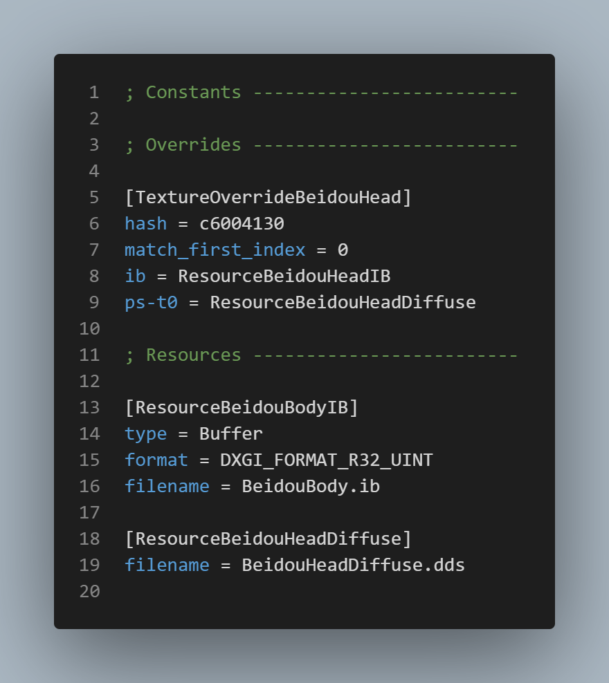

<!--
V1.3.1
Author: lewis252310 (DC-AGMG !someone name has 63B long?)
Helper: LeoMod, DiXiao, silent

-->

#### 前言
這是一個基於 GIMI 的 ini 檔案解析/教學/文檔
並且這是第一個版本，所以涵蓋範圍只有最基礎的語法。
並且可能需一些程式語言的基礎。
不過不用擔心，後續我會慢慢更新的，最終目標是能夠讓所有人讀懂。
最初使用中文撰寫，所以如果你閱讀的並不是中文版本，可能需要注意一下翻譯上造成的歧異問題。

---

### 注意！以下所述僅限 GIMI，並不適用於以外的範圍。

---

### .ini 結構簡述
由於 ini 不是本篇的重點，並且 ini 相關語法可以在網路上找到，
所以這邊只會用最簡短的方式告訴你如何看懂 ini。
底下這是個範例，來源是一個很普通的 mod。

可以簡單分成三個部分。節、參數與註解。
其中節和參數無大小寫之分，但在 GIMI 裡節會以大駝峰風格進行編寫。

__**節 (section)**__
被`[]`框起來的部分就是**節**…的開頭。
因為節是一個代碼區域(Code Block)的概念，其範圍包括當前行到下一個**節**的上一行，或是文件末尾。

__**參數 (properties)**__
或是叫屬性。是節的子項目(至少到目前我都還沒有看過單獨存在的參數)。簡易的判斷方法是必定有一個`=`存在。

__**註釋 (comments)**__
又稱註解，從`;`開始，直到行結束。
這邊有一個點要注意，ini 只能註釋單獨行，也就是說把分號放在參數或節之後是不允許的。
```ini
; 單獨註釋整行，允許
[TextureOverrideA] ; 在節或參數之後註釋，不允許
hash = abcd1234 ; 其實可以看到在錯誤地方註釋的話註釋會是錯誤的顏色
```

ini 的簡單介紹就到這裡，基本上只要知道怎麼分辨節跟參數，會寫註釋就夠了。
如果還有興趣請自行[上網](https://wangchujiang.com/reference/docs/ini.html)找查或 [Wiki](https://en.wikipedia.org/wiki/INI_file)。
最後再重複一次，ini 無大小寫之分，但在 GIMI 中節的名稱是大駝峰風格。

---

現在可以來說說 GIMI 實際上會用到的各種東西了。我們就從 GIMI 的 ini 檔案中的各種保留字開始。

### 語法樹
> 這裡是語法樹，修飾詞在下一節

[[\*Override\*]](#override)

├ [hash](#hash)

├ [handling](#handling)

├ [drawindexed](#drawindexed)

├ [match_first_index](#match_first_index)

├ [vb0, vb1, vb2, ...](#vbx)

├ [ib](#ib)

├ [ps-t0, ps-t1, ps-t2, ps-t3, ...](#ps-tx)

├ [filter_index](#filter_index)

├ [allow_duplicate_hash](#allow_duplicate_hash)

├ [match_priority](#match_priority)

├ [match_type](#match_type)

├ [match_width](#match_width)

├ [match_height](#match_height)

├ [match_msaa](#match_msaa)

├ [match_msaa_quality](#match_msaa_quality)

├ [match_usage](#match_usage)

├ [match_bind_flags](#match_bind_flags)

├ [match_cpu_access_flags](#match_cpu_access_flags)

├ [match_misc_flags](#match_misc_flags)

├ [match_byte_width](#match_byte_width)

├ [match_stride](#match_stride)

├ [match_mips](#match_mips)

├ [match_format](#match_format)

├ [match_depth](#match_depth)

└ [match_array](#match_array)


[[Resourse*]](#resource)

├ [type](#type-resourse)

├ [filename](#filename)

├ [format](#format)

├ [stride](#stride)

└ [data](#data)


[[CommandList*]](#commandlist)


[[Constants]](#constants)


[[Present]](#present)


[[Key*]](#key-section)

├ [key](#key-properties)

├ [type](#type-key)

├ [warp](#warp)

├ [delay](#delay)

├ [release_delay](#release_delay)

├ [transition](#transition)

├ [transition_type](#transition_type)

├ [release_transition](#release_transition)

├ [release_transition_type](#release_transition_type)

├ [convergence](#convergence)

└ [separation](#separation)


[[CustomShader*]](#customshader)

├ [topology](#topology)

├ [cull](#cull)

├ [fill](#fill)

├ [blend](#blend)

├ [alpha](#alpha)

├ [max_executions_per_frame](#max_executions_per_frame)

└ [alpha_to_coverage](#alpha_to_coverage)

> 如果沒有在這裡找到你需要的，那可能是保留字或修飾詞。

---

### 修飾詞
> 這裡是修飾詞，語法樹在上一節


[post](#post)

[pre](#pre)

[global](#global)

[local](#local)

[persist](#persist)

[ref | reference](#ref)

[copy](#copy)

---

### 保留字
> 這裡是參數保留字，

[x, y, z, w](#著色器變量)

[if, endif, else if, else](#條件-condition)

[run](#run)

[time](#time)

---

### 規則
> 這裡是一些通用規則


[變數 (variable)](#變數-variable)

[條件 (condition)](#條件-condition)

[錯誤訊息 (ERROR msg)](#錯誤訊息-error-msg)

[運算符 (Operators)](#邏輯運算福-logical-operators)

---

## Override

有紋理覆蓋(`TextureOverride`)與著色器覆蓋(`ShaderOverride`)兩種。
當螢幕上有對應的哈希值物件時便會觸發對應的 Override 節運作。
是 GIMI 的運作核心，是所有 Mod 的開始。
```ini
[*Override*]
[TextureOverrideLumineBody]
[ShaderOverridGroundHealthBar]
```

#### hash

[Override](#override) 參數。
告訴 GIMI 他需要注意哪個物件，並且發現時執行對應的動作。
```ini
[TextureOverrideLumineBody]
hash = afd36b46
```

#### handling

[Override](#override) 參數。
對指定物件的渲染操作，通常會使用 skip 來跳過渲染。
```ini
[TextureOverrideLuminePantsu]
handling = skip
```

#### drawindexed

告訴 GIMI 進行我們自己的繪製，而不是使用遊戲繪製。
通常會和 [handling](#handling) 一起使用。
```ini
[TextureOverrideLumineBody]
drawindexed = auto
```

#### draw
預先建立所需要的緩衝區大小，目前只在 Blend 項下出現過。
```ini
[TextureOverrideLumineBlend]
draw = 25600, 0
```

#### match_first_index

指定緩衝區的起始位置。有時候一個哈希可能包含不只一個物件，所以需要指定才能正確加載資源。
```ini
[TextureOverrideLumineBody]
match_first_index = 25600
```

#### vbx
頂點緩衝區(vertex buffer)。通常會直接指向其他 [Resource](#resource) 節。
```ini
[TextureOverrideLumineBody]
vb0 = ResourceLuminePosition
```

#### ib
縮引緩衝區(index buffer)。通常會直接指向裝有 IB 的 [Resource](#resource) 節。
```ini
[TextureOverrideLumineBody]
ib = ResourceLumineBodyIB
```

#### ps-tx
紋理資源層。有幾種不同的類型，對於 GIMI 來說 t0 是紋理貼圖，t1 是光線貼圖，t2 是光澤貼圖，t3 是陰影貼圖。
```ini
[TextureOverrideLuminePantsu]
ps-t0 = ResourceLuminePantsuDiffuse
ps-t1 = ResourceLuminePantsuLightMap
ps-t2 = ResourceLuminePantsuMetalMap
ps-t3 = ResourceLuminePantsuShadowRamp

```

#### filter_index

宣告一個檢查值，並且在其夥伴物件上進行檢查或是用於賦值。
這對於某些嚴格條件或是跨物件判斷時是非常強大且精準的。
關於夥伴物件和其相關檢查方式由於異常複雜且難以理解，在 Docs 建置初期將不會對此進行講解。 `Timestamp=2023-07-20`

<!-- 
Partner objects are objects of different types that share common parts.
For example, A IB and a PS which draw the pause page at the same time, there are a pair of partner objects.
When checking at partner object, need to check the type of the object that **declares filter_index properties**.
Here is an example.
```ini
[TextureOverrideLumineBikiniIB]
filter_index = 5

[ShaderOverrideLumineBikiniPS]
if ib == 5
    run = CommandListLumineChangeSunglasses
endif
```
In this case, When LumineBikiniIB is drawing, the filter_index properties will be execute at the same time.
And when LumineBikiniPS is drawing, a condition will execute. if ib == 5 then run CommandListLumineChangeSunglasses.
The part of ib == 5 is the filter_index = 5 properties which from LumineBikiniIB.
Rest is the same, if filter_index is declared in vs, then in its partner object it is checking if vs is the specified value.
 -->

<!-- 
所謂夥伴物件是指不同類型但有共同部分的物件，例如同時繪製暫停頁面的 IB 和 PS 就是一對夥伴物件。
在夥伴物件檢查時需以**宣告此參數**的物件的類型做檢查。
這邊直接上例子
```ini
[TextureOverrideLumineBikiniIB]
filter_index = 5

[ShaderOverrideLumineBikiniPS]
if ib == 5
    run = CommandListLumineChangeSunglasses
endif
```
在這個例子中，當 LumineBikiniIB 被繪製時同時會運行 filter_index 參數
而在 LumineBikiniPS 被繪製時會執行一個條件，如果 ib == 5 則運行 LumineChangeSunglasses
當中 ib == 5 的來源就是 LumineBikiniIB 運行的 filter_index = 5 參數
剩餘同理，如果是在 vs 中使用 filter_index，那麼在其夥伴物件就是檢查 vs 是否為指定值。
這邊還不清楚的地方是如果是在 PS 使用 filter_index 應該對哪一層資源進行判斷，是 ps-t0 抑或 ps。
 -->


```ini
[TextureOverrideLumineGlasses]
filter_index = 34
```

#### allow_duplicate_hash
ShaderOverride 參數。
控制允許覆蓋同樣 hash 與否。
可用值有：
 - true - 有重複時覆蓋
 - false - 有重複時不覆蓋
 - overrule - 強制覆蓋，好像是插件層級的覆蓋。
```ini
[ShaderOverrideLumineQEffect]
hash = 030dbce199e10697
allow_duplicate_hash = overrule
```

#### match_priority
TextureOverride 參數。
宣告覆蓋先後的順序權重。值越高則越優先。
GIMI 裡不怎麼會用到，唯一會用上的情況是用他來消除哈希相衝的問題，直接宣告成 0 就好了。
```ini
[TextureOverrideLumineGlasses]
match_priority = 0
```

#### match_type
TextureOverride 參數。
代替 [hash](#hash)。當所選類型的任意物件被渲染時調用。
```ini
[TextureOverrideTexture2D]
match_type = Texture2D
```

#### match_width
TextureOverride 參數。
檢查並匹配紋理資源的寬度。
```ini
[TextureOverrideWidth1024]
match_width = 1024
```

#### match_height
TextureOverride 參數。
檢查並匹配紋理資源的高度。
```ini
[TextureOverrideHeight1024]
match_height = 1024
```

#### match_msaa
TextureOverride 參數。
按照 MSAA 過濾(我們不使用)。
```ini
[TextureOverrideMsaa]
match_msaa = 1
```

#### match_msaa_quality
TextureOverride 參數。
```ini
[TextureOverrideMsaaQuality]
match_msaa_quality = 1
```

#### match_usage
TextureOverride 參數。
這個設置沒有太大的意義，默認 DEFAULT。
更詳細的資訊在[這裡](https://learn.microsoft.com/en-us/windows/win32/api/d3d11/ne-d3d11-d3d11_usage)
```ini
[TextureOverrideUsage]
match_usage = IMMUTABLE
```

#### match_bind_flags
TextureOverride 參數。
另一種過濾器。
在標誌前添加 `+` 或 `-` 來改變過濾運作。
如果沒有添加 `+` 或 `-` 則不使用該過濾器。
(我知道這說明有點模糊，之後會繼續詳細。)
```ini
[TextureOverrideAllBindFlags]
match_bind_flags = +VERTEX_BUFFER -INDEX_BUFFER CONSTANT_BUFFER SHADER_RESOURCE STREAM_OUTPUT RENDER_TARGET DEPTH_STENCIL UNORDERED_ACCESS DECODER VIDEO_ENCODER
```

#### match_cpu_access_flags
TextureOverride 參數。
另一種過濾器。
在標誌前添加 `+` 或 `-` 來改變過濾運作。
如果沒有添加 `+` 或 `-` 則不使用該過濾器。
(我知道這說明有點模糊，之後會繼續詳細。)
```ini
[TextureOverrideAllCPUAccessFlags]
match_cpu_access_flags = +READ -WRITE
```

#### match_misc_flags
TextureOverride 參數。
另一種過濾器。
在標誌前添加 `+` 或 `-` 來改變過濾運作。
如果沒有添加 `+` 或 `-` 則不使用該過濾器。
(我知道這說明有點模糊，之後會繼續詳細。)
```ini
[TextureOverrideAllMiscFlags]
match_misc_flags = GENERATE_MIPS SHARED TEXTURECUBE DRAWINDIRECT_ARGS BUFFER_ALLOW_RAW_VIEWS BUFFER_STRUCTURED RESOURCE_CLAMP SHARED_KEYEDMUTEX GDI_COMPATIBLE SHARED_NTHANDLE RESTRICTED_CONTENT RESTRICT_SHARED_RESOURCE RESTRICT_SHARED_RESOURCE_DRIVER GUARDED TILE_POOL TILED
```

#### match_byte_width
TextureOverride 參數。
匹配字節(byte)長度
```ini
[TextureOverrideByteWidth]
match_byte_width = res_width * res_height
```

#### match_stride
TextureOverride 參數。
某種跟跟緩衝器(Buffer)有關的東西。
(應該是跟 [stride](#stride) 有關的，字面意思則是匹配 stride 的值，需要進一步測試。)
```ini
[TextureOverrideStride]
match_stride = 40
```

#### match_mips
TextureOverride 參數。
```ini
[TextureOverrideMips]
match_mips = 1
```

#### match_format
TextureOverride 參數。
依照 [format](#format) 過濾。
對於修改沒有恆定 [hash](#hash) 的資源很有用。
DX 格式列表在[這裡](https://learn.microsoft.com/en-us/windows/win32/api/dxgiformat/ne-dxgiformat-dxgi_format)
```ini
[TextureOverrideFormat]
match_format = R32G32B32A32_FLOAT
```

#### match_depth
TextureOverride 參數。
(應該是紋理的深度。)
```ini
[TextureOverrideDepth]
match_depth = 1
```

#### match_array
TextureOverride 參數。
(應該是紋理的某種資料陣列。)
```ini
[TextureOverrideArray]
match_array = 12
```

---

## Resource

我不確定他是不是 GIMI 保留字之一，但因為帶有資源的節基本都是以`Resource`開頭，姑且也視為節保留字吧。
除了便於識別，也比較不會跟其他真正有特殊用途的節搞混。
通常用於儲存各種資源的位置。
```ini
[Resource*]
[ResourceLuminePantsu]
[ResourceMyRGBWeapon]
```

#### type (Resourse)
這的是 [Resourse](#resource) 下的參數，而不是 [Key](#key-section) 下的參數。
宣告這個資源的類型，一般來說只會用到緩衝(Buffer)類型。
```ini
[ResourceLuminePantsuPosition]
type = Buffer
``` 

#### filename

只出現在 [Resourse](#resource) 底下，使用相對路徑指向資源的儲存位置。
不清楚是否支持絕對路徑，但在這種可轉發數據資料中使用絕對路徑也沒有意義。
```ini
[ResourceLumineBodyDiffuse]
filename = .\Lumineparts\LumineBodyDiffuse.dds
```

#### format
用於 IB 資源，單個縮引值的大小
```ini
[ResourceLumineBodyIB]
format = DXGI_FORMAT_R32_UINT
```

#### stride
用於 VB 資源，單個頂點總數據的字節大小
```ini
[ResourceLuminePantsu]
stride = 20
```

#### data
用於詳細日誌紀錄、用戶介面文本等
```ini
[ResourceLuminePantsu]
data = "Jsut a string."
```

---

## CommandList

我不確定`CommandList`是不是保留字之一，因為理論上他就只是一個好幾條參數堆在一起的節，只有在有需要的時候才會呼叫。
不過其功能類似於 Function，所以我認為還是視為保留字會比較好。
```ini
[CommandList*]
[CommandListToggleLogic]
[CommandListCallTheAmbulance]
```
由於 `CommandList` 裡全都是進階的運算，所以沒有任何固定參數。
唯一會重複看到的就是各種[變數](#變數-variable)和[條件](#條件-condition)

---

## Constants

全域變數的初始化位置。
只要是全域變數(`global $var`)都需要在`Constants`節底下宣告，不然 GIMI 認不出你的變數。
只會在讀取 ini 時運行一次。[變數相關請戳我](#變數-variable)。
```ini
[Constants]
global $active = 0
```

---

## Present

不斷重複執行的節。
這個節會在每一幀開始時運行一次。
通常會放入各種需要實時計算的代碼，例如按鍵切換外觀等...各種交互表現。
```ini
[Present]
post $active = 0
```
`Constants` 同 [CommandList](#commandlist) 是用於各種運算的區域，所以也沒有固定參數，但一般來說不會在這裡直接指向 [Resource](#resource)，而是先指向 `CommandList` 再去呼叫 `Resource`


---

## Key (section)

定義 GIMI 要偵測那些按鍵的狀況。
按下去之後執行設定好的運作。
下面這個例子定義了一個 Q 鍵，[類型](#type-key)則是`toggle`
```ini
[KeyHelp]
key = q
type = toggle
```

#### key (properties)
用於 [Key](#key-section) 節，指定要監聽哪個按鍵。
可以複數設置，即將不同按鍵綁定到同一個 Key 節
在[這裡](https://learn.microsoft.com/zh-tw/windows/win32/inputdev/virtual-key-codes?redirectedfrom=MSDN)可以找到所有可用的按鍵類型。
```
[KeyHelp]
key = q
key = XB_X
```

#### type (Key)

這的是 [Key section](#key-section) 下的參數，而不是 [Resourse](#resource) 下的參數。
宣告 [key](#key-properties) 的類型。有四種可用值，分別是默認、cycle、hold 及 toggle。
1. 默認：單純運行。沒有寫 type 時默認的類型，單純運行所寫配置。
   ```ini
   [KeyK]
   key = k
   type = cycle
   $swapvar = 0, 1, 2, 3
   ```
2. cycle：循環。按順序遍歷所寫列表，可藉由 [warp](#warp) 控制是否頭尾相連循環。
    ```ini
    [KeyK]
    key = k
    type = cycle
    $swapvar = 0, 1, 2, 3
    ```
3. hold：長按。按壓時持續觸發，並在釋放時恢復原本的值(其實就是 toggle type 的加長版)。可以應用在一些需要長按的技能上。
   ```ini
   [KeyK]
   key = k
   type = hold
   $holdding = 1
   ```
4. toggle：開關。單純的開關，會在指定值與 0 之間切換，如沒有指定值則預設 1。
   ```ini
   [KeyK]
   key = k
   type = toggle
   $switch = 2
   ```

#### warp
控制 key - cycle 類型時是否允許頭尾相連循環。
預設值為 True。
```ini
[KeyK]
key = k
warp = false
type = cycle
$swapvar = 0, 1, 2, 3
```

#### delay
**注意，現在這個參數是一個運作方式不如預期的參數，未來可能會修改。**
~~設置 key - hold 需要按住多久後才執行操作。~~
設置 key 需要按住多久才執行操作。
單位為毫秒(ms)。
```ini
[KeyK]
key = k
type = cycle
delay = 100
$swapvar = 0, 1, 2, 3
```
這裡的 delay 設置 100，也就是說要長按 k 超過 100ms 之後才會觸發。
另外需要注意的是，目前的 delay 和 [key - hold](#type-key) 關係不明確。(雖然在找到的文檔中表示目前暫時只能應用於 hold?)

#### release_delay
設置 key - hold 在釋放按鍵之後繼續執行的額外時間。
單位為毫秒(ms)。
```ini
[KeyK]
key = k
type = hold
release_delay = 600
```
這裡 release_delay 設置 600，也就是說在釋放 k 之後還會持續 600ms 的運作。

#### transition
**注意，現在還不清楚這個參數在 GIMI 中的作用，所以不過多論述。**
觸發時，平滑過度物件在兩個關鍵幀之間的視覺效果。
單位為毫秒(ms)。
```ini
[KeyK]
key = k
transition = 100
```


#### transition_type
**注意，現在還不清楚這個參數在 GIMI 中的作用，所以不過多論述。**
指定 [transition](#transition) 所使用的平滑曲線類型。
目前已知有 linear 和 cosine 類型。
```ini
[KeyK]
key = k
transition = 100
transition_type = linear
```

#### release_transition
**注意，現在還不清楚這個參數在 GIMI 中的作用，所以不過多論述。**
釋放時，平滑過度物件在兩個關鍵幀之間的視覺效果。
單位為毫秒(ms)。
```ini
[KeyK]
key = k
release_transition = 200
```

#### release_transition_type
**注意，現在還不清楚這個參數在 GIMI 中的作用，所以不過多論述。**
指定 [release_transition](#release_transition) 所使用的平滑曲線類型。
目前已知有 linear 和 cosine 類型。
```ini
[KeyK]
key = k
release_transition = 200
release_transition_type = cosine
```

#### convergence
**注意，現在還不清楚這個參數在 GIMI 中的作用，所以不過多論述。**
收斂。
```ini
[KeyK]
key = k
convergence = 0.7
```

#### separation
**注意，現在還不清楚這個參數在 GIMI 中的作用，所以不過多論述。**
分離。
```ini
[KeyK]
key = k
separation = 1.2
```

## CustomShader

運行我們自己的著色器
```ini
[CustomShaderWOW]
handling = skip
drawindexed = auto
```

#### topology
更改物件的渲染類型。[這裡](https://learn.microsoft.com/en-us/windows/win32/direct3d11/d3d11-primitive-topology  
)有更詳細的資訊。
可用值：  
 - point_list  
 - line_list  
 - line_strip  
 - triangle_list  
 - triangle_strip  
 - line_list_adj  
 - line_strip_adj  
 - triangle_list_adj  
 - triangle_strip_adj  
 - 1_control_point_patch_list  
 - 2_control_point_patch_list  
 - 3_control_point_patch_list  
 - 4_control_point_patch_list  
 - 5_control_point_patch_list  
 - 6_control_point_patch_list  
 - 7_control_point_patch_list  
 - 8_control_point_patch_list  
 - 9_control_point_patch_list  
 - 10_control_point_patch_list  
 - 11_control_point_patch_list  
 - 12_control_point_patch_list  
 - 13_control_point_patch_list  
 - 14_control_point_patch_list  
 - 15_control_point_patch_list  
 - 16_control_point_patch_list  
 - 17_control_point_patch_list  
 - 18_control_point_patch_list  
 - 19_control_point_patch_list  
 - 20_control_point_patch_list  
 - 21_control_point_patch_list  
 - 22_control_point_patch_list  
 - 23_control_point_patch_list  
 - 24_control_point_patch_list  
 - 25_control_point_patch_list  
 - 26_control_point_patch_list  
 - 27_control_point_patch_list  
 - 28_control_point_patch_list  
 - 29_control_point_patch_list  
 - 30_control_point_patch_list  
 - 31_control_point_patch_list  
 - 32_control_point_patch_list  
```ini
[CustomShaderTopology]
topology = point_list
handling = skip
drawindexed = auto
```

#### cull

指定不繪製朝向特定方向的三角形。[這裡](https://learn.microsoft.com/en-us/windows/win32/api/d3d11/ne-d3d11-d3d11_cull_mode  )有更詳細的資訊。
可用值：
 - none  
 - front  
 - back  
```ini
[CustomShaderCull]
cull = none
handling = skip
drawindexed = auto
```

#### fill

指定渲染三角形時使用的填充方式。[這裡](https://learn.microsoft.com/en-us/windows/win32/api/d3d11/ne-d3d11-d3d11_fill_mode)有更詳細的資訊。
可用值：  
 - wireframe    
 - solid    
```ini
[CustomShaderFill]
fill = solid
handling = skip
drawindexed = auto
```

#### blend
  
Blend 因子，用於調節像素著色器和渲染目標的值。[這裡](https://learn.microsoft.com/en-us/windows/win32/api/d3d11/ne-d3d11-d3d11_blend)有更詳細的資訊。
兩種應用方式。

1. blend = disable  
2. blend = BlendOp SrcBlend DestBlend

其中 SrcBlend 和 DestBlend 可用值有：  
 - zero  
 - one  
 - src_color  
 - inv_src_color  
 - src_alpha  
 - inv_src_alpha  
 - dest_alpha  
 - inv_dest_alpha  
 - dest_color  
 - inv_dest_color  
 - src_alpha_sat  
 - blend_factor  
 - inv_blend_factor  
 - src1_color  
 - inv_src1_color  
 - src1_alpha  
 - inv_src1_alpha  

BlendOp 可用值有：  
 - add  
 - subtract  
 - rev_subtract  
 - min  
 - max  

而 blend 是 blend[0]~blend[7]

```ini
[CustomShaderBlend]
blend[0] = add src_alpha inv_src_alpha
handling = skip
drawindexed = auto
```

#### alpha

alpha = BlendOpAlpha SrcBlendAlpha DestBlendAlpha

其中 SrcBlendAlpha 和 DestBlendAlpha 可用值有：  
 - zero  
 - one  
 - src_color  
 - inv_src_color  
 - src_alpha  
 - inv_src_alpha  
 - dest_alpha  
 - inv_dest_alpha  
 - dest_color  
 - inv_dest_color  
 - src_alpha_sat  
 - blend_factor  
 - inv_blend_factor  
 - src1_color  
 - inv_src1_color  
 - src1_alpha  
 - inv_src1_alpha  

BlendOpAlpha 可用值有：
 - add  
 - subtract  
 - rev_subtract  
 - min  
 - max  

而 alpha 是 alpha[0]-alpha[7]

```ini
[CustomShaderAlpha]
alpha[0] = add src_alpha inv_src_alpha
handling = skip
drawindexed = auto
```

#### max_executions_per_frame
**資料過少無法翻譯。**
max_executions_per_frame to limit this to the first time the reflection。
```ini
[CustomShaderMEPF]
max_executions_per_frame = 1
handling = skip
drawindexed = auto
```

#### alpha_to_coverage
Alpha-to-coverage 是一種多採樣技術，對於茂密樹葉等情況最有用。其中存在多個使用 Alpha 透明度來定義表面內邊緣的重疊多邊形。
```ini
[CustomShaderATC]
alpha_to_coverage = 0
handling = skip
drawindexed = auto
```

---

## 修飾詞

#### post

指定對應參數在幀 ***結束時*** 運算，例如設定幀結束時間。
```ini
post $triggerDate = time
```

#### pre

指定對應參數在幀 ***開始時*** 運算，例如計算 [Present](#present) 的運行次數。
```ini
pre $auxTime = $auxTime + 1
```

#### global

宣告**全域**變數時必要的修飾詞。 [變數規則請戳我](#變數-variable)
另外注意，全域變數只會在 [Constants](#constants) 宣告。
```ini
[Constants]
global $a_global_var = 1
```

#### local

宣告**區域**變數時必要的修飾詞。 [變數規則請戳我](#變數-variable)
區域變數可以在任何需要計算的地方隨時宣告，但不確定 GIMI 對於區域變數的回收機制是如何，至少到目前 local 變數見的不多。
```ini
[AnySection]
local $i = 0
```

#### persist

宣告變數**持久化**時必要的修飾詞。 [變數規則請戳我](#變數-variable)
只會使用在全域變數(global)的宣告上，宣告後這個變數就會持久儲存在`d3dx_user.ini`裡，只有使用`Ctrl + Alt + F10`之後才會重製。
```ini
[Constants]
global persist $a_persist_var = 1
```

#### ref
`ref` 或 `reference`。用來指向資源的指針。
程序猿或許會喜歡這個強大的工具。

```ini
pre ResourceHelp = ref ResourceHelpFull
pre ResourceHelp = reference ResourceHelpFull
```

#### copy

將資源複製到新的資源中。
在資源被其他著色器或繪製調用修改之前保留一份副本是很有幫助的。
```ini
pre ResourceHelp = copy ResourceHelpFull
```

---

## 保留字

#### 著色器變量
x, y, z 和 w 是能夠從著色器訪問的變量。缺點是他們沒有命名空間，所以在使用上會顯得有些笨拙。
在 ini 中也能夠作為一般變數(但極度不推薦)。
```ini
[CommandListRGBPantsu]
x = 1
y = 0
z = 1
w = 1.5
```

#### run

宣告要執行的節。
常見的就是指向 [CommandList](#commandlist) 去做更進一步的運算。
```ini
[KeyChangeColor]
run = CommandListLumineChangePanTsuColor
```

#### time

內置變量。
遊戲啟動後到現在的浮點時間，單位為秒。
```ini
$last_date = time
```

---

#### 變數 (variable)

GIMI 中只有以`$`符號開頭才會識別為變數，而如果在一些應該是變數的位置卻沒有`$`符號，那個就是[保留字](#保留字)。
```ini
$last_date = time
; $last_date 是我們設定的變數，time 則是 GIMI 的保留字。
```
[time 相關在這裡](#time)

#### 條件 (condition)

GIMI 中的條件控制保留字有`if`，`else if`，`else`以及`endif`
用`if`開始條件塊，用`endif`結束條件塊。支持巢狀。
如果你是程式語言新手，請從其他程式語言的條件語法來熟悉條件控制，本篇將不過多敘述。
```ini
if time == $lest_date + 10.0
    run = CommandListA
else if time == $lest_date + 15.0
    run = CommandListB
else
    run = CommandListC
endif
```

#### 錯誤訊息 (ERROR msg)

大多數編譯錯誤，尤其是關於著色器方面的衝突會在螢幕左上角顯示。
當涉及 `ini` 時會顯示警告，提示發現到的可能造成問題的衝突。
人類可讀，可以很好的了解衝突文件在哪裡。

#### 算數運算符 (Arithmetical Operators)

這只是一個在 GIMI 允許使用的算數運算符列表，不包含任何教程。

| Operators | Name           | Note              |
| --------- | -------------- | ------------------|
| +         | Addition       |                   |
| -         | Subtraction    |                   |
| *         | Multiplication |                   |
| /         | Division       |                   |
| %         | Modulus        |                   |
| =         | Assignment     |                   |
| ==        | Equal          |                   |
| !=        | Not equal      |                   |
| !==       | Not equal      | 同 `!=` 但是更嚴格 |

#### 邏輯運算符 (Logical Operators)

這只是一個在 GIMI 允許使用的邏輯運算符列表，不包含任何教程。

| Operators | Name           | Note              |
| --------- | -------------- | ----------------- |
| &&        | AND            |                   |
| \|\|      | OR             |                   |
| ( )       | Parenthesis    |                   |
